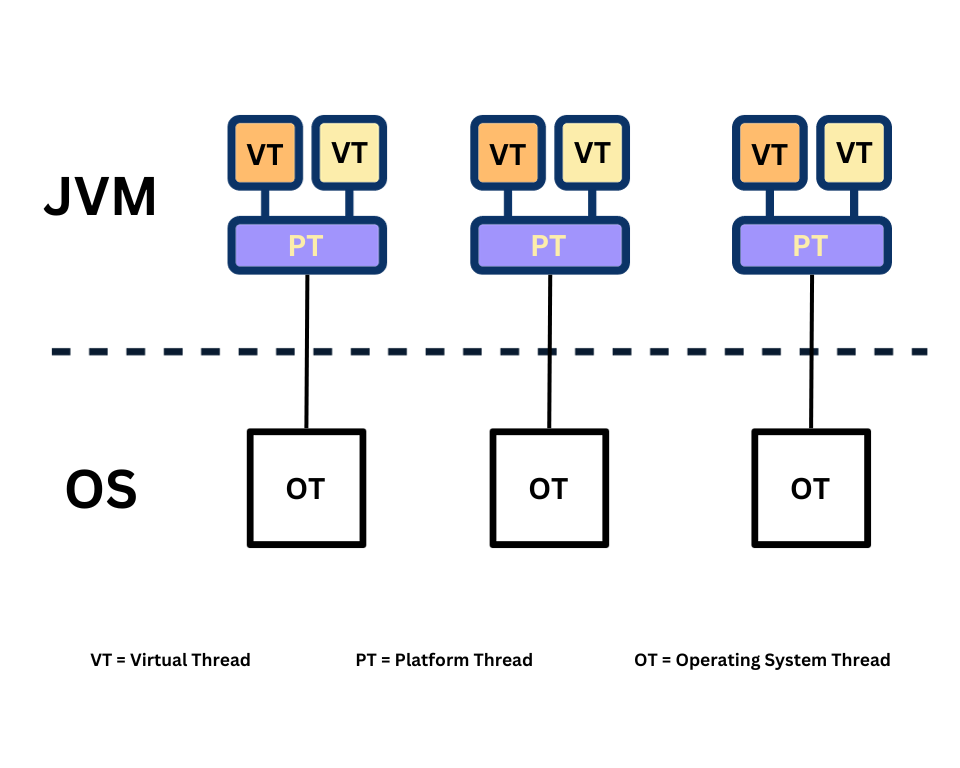
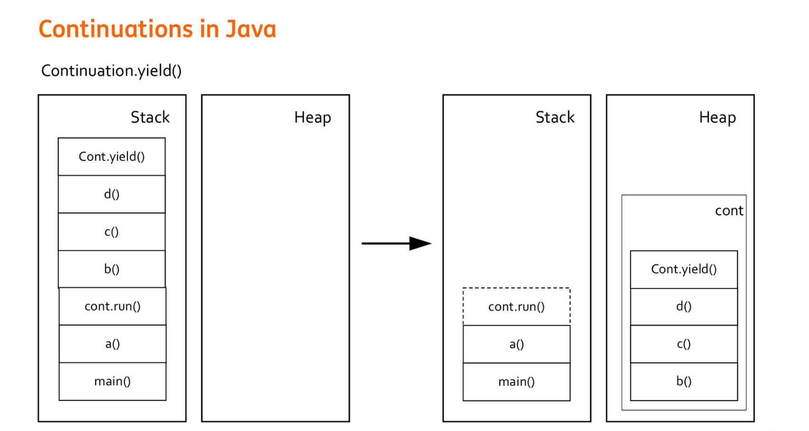
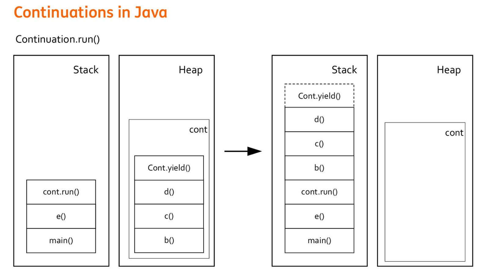

## 什么是Virtual Thread
`Virtual Thread` 在 `JDK 21`中引入，相比于`Thread(Platform Thread)`，`Virtual Thread`是运行在`Platform Thread`上的线程，`Platfrom Thread` 与 `OS Thread` 的关系是 `1:1` 对应，而 `Virtual Thread` 与 `Platform Thread` 的关系是 `N:1` 对应，多个 `Virtual Thread` 对应一个 `Platform Thread`， `Virtual Thread` 运行时挂载到 `Platform Thread` 上，阻塞时则从 `Platform Thread` 上解除挂载将 `Platfrom Thread` 释放给其他的 `Virtual Thread` 进行挂载使用。



在一个典型的服务端应用程序中，请求处理逻辑如下所示：
```java
public Order placeOrder(String cartId) {

  // Fetch cart from DB, it is a blocking DB call
  var cart = cartRepo.fetchCartById(cartId);

  var order = Order.newOrder(cart);

  // some business logic here, more DB calls, maybe some network calls

  // Save Order to DB, again a blocking call
  orderRepo.save(order);

  return order;
}
```

在上面的代码执行中，对于 `Platform Thread`，线程执行过程中，如果遇到了阻塞如数据库调用等，就会等待阻塞完成，这样就会造成资源的浪费，因为在等待过程中，`Platform Thread` 占据的资源没有被利用。

而 `Virtual Thread` 则解决了这个问题，当 `Virtual Thread` 执行上面这段代码时，如果遇到阻塞，那么 `Virtual Thread` 就会与 `Platform Thread` 进行解绑操作，这样其他的 `Virtual Thread` 就可以使用这个 `Platform Thread` 来执行其他操作，提高了阻塞时的资源利用率，等到阻塞完成之后，被阻塞的 `Virtual Thread` 会重新绑定一个 `Platfrom Thread` （不一定与之前的相同）来继续执行。

因此在**高 I/O** 情况下使用 `Virtual Thread` 的性能会比使用 `Platform Thread` 的性能高出很多。 

## 如何使用Virtual Thread

### 通过 Thread.startVirtualThread()创建

通过`Thread.startVirtualThread()`方法创建并启动一个虚拟线程，代码如下：
```java
public class VirtualThreadTest { 

  public static void main(String[] args) { 
    CustomThread customThread = new CustomThread();
    // 创建并且启动虚拟线程
    Thread.startVirtualThread(customThread); 
  }
}

class CustomThread implements Runnable { 
  @Override 
  public void run() { 
    System.out.println("CustomThread run"); 
  } 
}
```

### 通过Thread.ofVirtual()创建

通过`Thread.ofVirtual().unstarted()`方法创建一个未启动的虚拟线程，然后通过`Thread.start()`来启动线程，代码如下：
```java
public class VirtualThreadTest {  
  public static void main(String[] args) { 
    CustomThread customThread = new CustomThread();
    // 创建并且不启动虚拟线程，然后 unStarted.start()方法启动虚拟线程
    Thread unStarted = Thread.ofVirtual().unstarted(customThread);
    unStarted.start(); 
    // 等同于
    Thread.ofVirtual().start(customThread); 
  }
}
class CustomThread implements Runnable { 
  @Override
  public void run() { 
    System.out.println("CustomThread run"); 
  }
}
```

### 通过ThreadFactory创建

通过 `ThreadFactory.newThread()`方式就能创建一个虚拟线程，然后通过 `Thread.start()`来启动线程，代码如下：

```java
public class VirtualThreadTest { 
  public static void main(String[] args) { 
    CustomThread customThread = new CustomThread();
    // 获取线程工厂类
    ThreadFactory factory = Thread.ofVirtual().factory();
    // 创建虚拟线程
    Thread thread = factory.newThread(customThread);
    // 启动线程
    thread.start(); 
  }
}

class CustomThread implements Runnable {
  @Override
  public void run() {
    System.out.println("CustomThread run");
  }
}
```


### 通过Executors.newVirtualThreadPerTaskExecutor()创建

通过 JDK 自带的 `Executors` 工具类方式创建一个虚拟线程，然后通过 `executor.submit()`来启动线程，代码如下：

```java
public class VirtualThreadTest {
  public static void main(String[] args) {
    CustomThread customThread = new CustomThread();
    ExecutorService executor = Executors.newVirtualThreadPerTaskExecutor();
    executor.submit(customThread);
  }
}
class CustomThread implements Runnable {
  @Override
  public void run() {
    System.out.println("CustomThread run");
  } 
}
```

## Virtual Thread 的原理

对于 `Virtual Thread`，其原理是使用 `Continuation` 来进行线程的暂停和继续。

对于线程的暂停，通过调用`Continuation.yield()`方法，`Continuation` 会将 `Virtual Thread` 执行的栈帧保存到 `Continuation` 对象中，即保存到**堆中**。



等到调用`Continuation.run()`方法恢复线程执行时，会从**堆中**将线程的栈帧取出继续执行。



## Virtual Thread 存在什么问题

如果 `Virtual Thread` 进入 `Synchronized` 代码块内部之后**被阻塞**，那么就会出现 **Virtual Thread Pinning** 的问题，即 `Virutal Thread` 与 `Platform Thread` 被锁定，此时 `Virtual Thread` 就无法从 `Platform Thread` 上解除挂载，如果所有的 `Platform Thread` 都被锁定，那么新的 `Virtual Thread` 就无法挂载到任何一个 `Platform Thread` 上，使得任务无法继续执行，这样就会大大降低 `Virtual Thread` 的性能。
```java
// Creating a new lock for each task demonstrates the difference between JDK 21 and 24
final Object lock = new Object(); 
synchronized (lock) {
    // Short sleep *inside* the lock
    // JDK 21: Pins carrier, making it unavailable for others' doCpuWork()
    // JDK 24: Unmounts carrier, allowing it to run others' doCpuWork()
    Thread.sleep(Duration.ofMillis(BLOCKING_TIME_MS));
}
```


## 如何解决 Virtual Thread Pinning问题

1. 使用 `ReentrantLock` 来 替换 `Synchronized`，这样就可以避免 Virtual Thread 与 Platform Thread 的绑定，因为 `Synchronized` 的底层是在 OS 级别进行上锁，所以 `JVM` 无法干预这个锁，而`ReentrantLock` 是由 `JVM` 进行管理，所以即使在上锁后，也可以将 Virtual Thread 从 Platform Thread 上解除挂载， 从而避免 **Virtual Thread Pinning** 的情况。
2. 使用 `JDK 24` ，在 `JDK 24` 中， 解决了 **Virtual Thread Pinning** 的问题，具体的说明可以查看[JEP 491](https://openjdk.org/jeps/491) 。


参考链接：
1. [Virtual Threads: Fast, Furious, and Sometimes Stuck](https://medium.com/@Games24x7Tech/virtual-threads-fast-furious-and-sometimes-stuck-654cde6c0c8c)
2. [Java 21 Virtual Threads - Dude, Where’s My Lock?](https://netflixtechblog.com/java-21-virtual-threads-dude-wheres-my-lock-3052540e231d)
3. [Concurrent programming in Java with virtual threads
](https://github.com/aliakh/demo-java-virtual-threads)
4. [The Idea Behind Java Virtual Threads - It's not about speed
](https://thebackendguy.com/posts/idea-behind-virtual-threads/)
5. [JEP 491: Synchronize Virtual Threads without Pinning
](https://openjdk.org/jeps/491)

